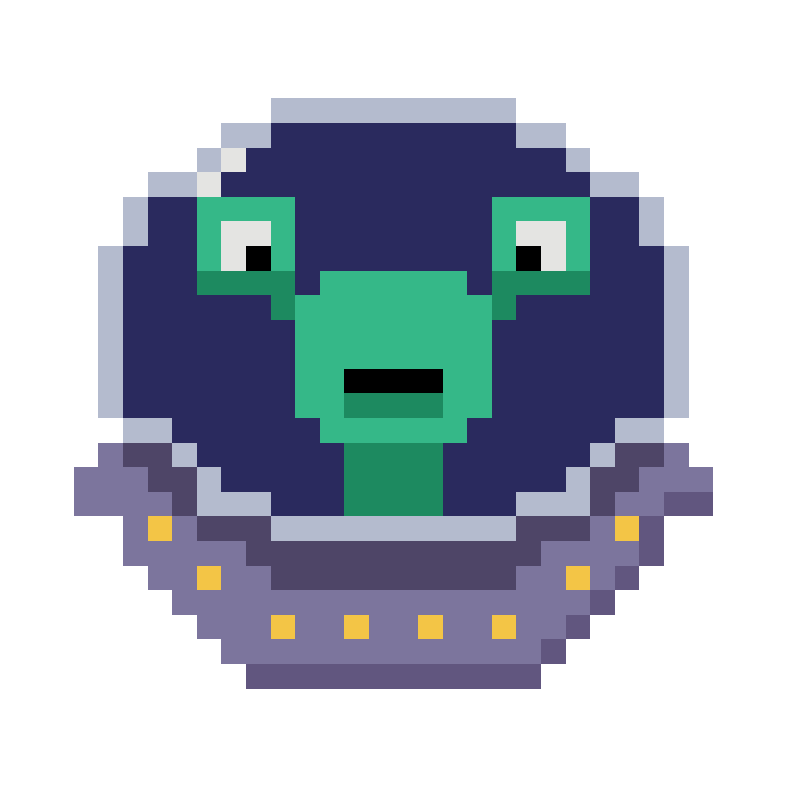

# TeleMemo

TeleMemo is a 2D pixel art game made in Unity. It is the first full video game I made! Play TeleMemo on itch.io here: https://spacedancer.itch.io/telememo

In TeleMemo, you are an alien and you want to conquer as many planets as possible. You will have some time to memorize the positions of the planets. Then, the planets will become invisible and able for you to conquer by teleporting to the right positions. But watch out, the black hole is coming! You will die when it reaches you or any of the planets you did not conquer yet. You have one Slo-Mo Power-Up per level, use it when the black hole is approaching you too fastly. You will also die if you teleported to the wrong positions too often, so think before you teleport!

----
## Game Jam

This game is my submission to Micro Jam 011 (Game Jam page: https://itch.io/jam/micro-jam-011).

Micro Jam is a Game Jam on itch.io and it has a time limit of 48 hours.
The Jam had the theme "Teleportation" and the prerequisite "Slow Motion".
The theme was announced a few days before the Jam started, while the prerequisite was published right when the 48 hours started.

## Next steps

I plan on developing TeleMemo further by adding more features, polishing the gameplay loop and adding/ revising assets. I also want to port it to mobile. Stay tuned!
